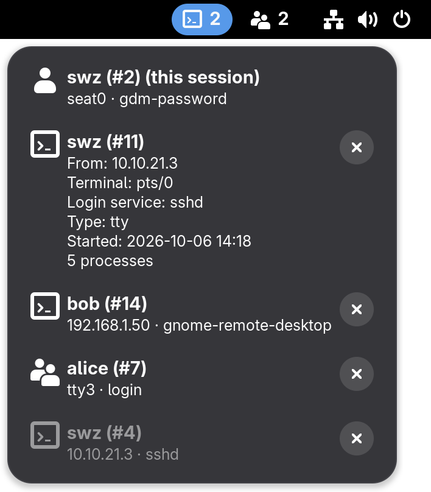
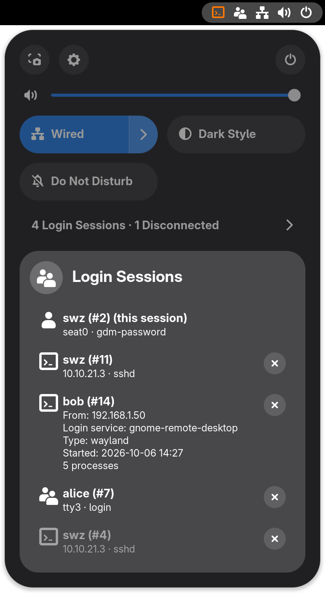
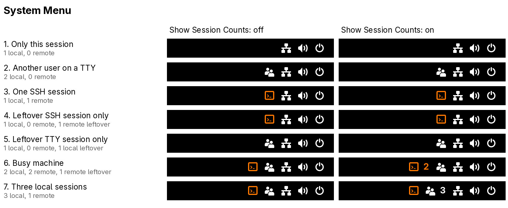
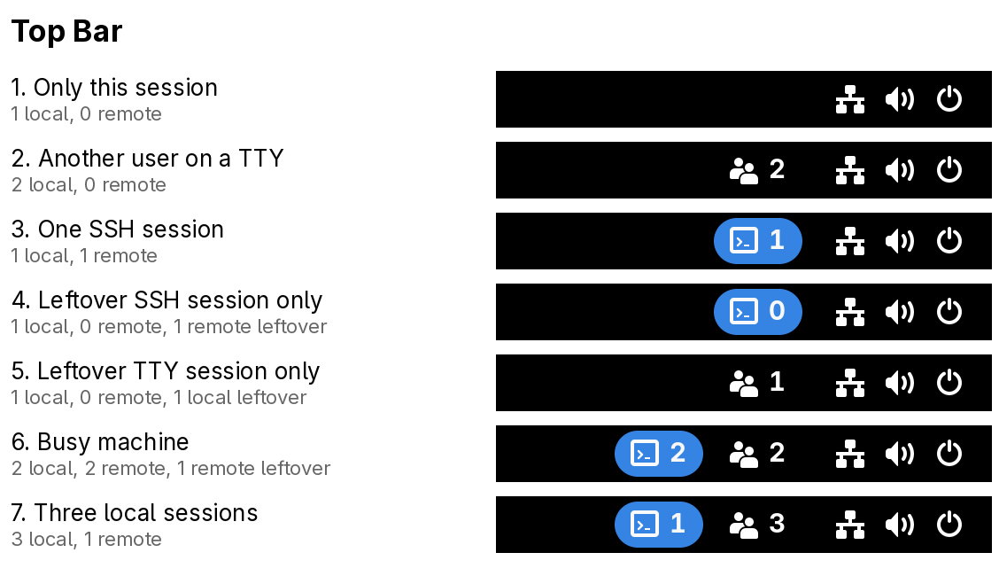

# Session Spy

  
  

A GNOME extension that shows who else is logged in to your computer, locally or remotely (SSH, remote desktop). 

| Current Support |
|-----------------|
| 46 – 51         |

## Usage:
1. Install and enable the extension
2. Whenever someone else is logged in, an icon shows in the top bar: an orange "terminal" for remote sessions, a white "users" for other local sessions
3. Open the system menu and click the "Login Sessions" row to see every session, with the current user session at the top
4. Click a session to expand it: where it comes from, how it logged in, when it started and how many processes it runs
5. Click the × next to a session to end it. A confirmation dialog will appear, with the processes that will stop with it listed; ending another user's session needs an administrator password

A session that was disconnected but still has processes running (e.g. tmux after an SSH connection dropped) is listed dimmed, and also shows its icon.

## Settings
Open the extension's preferences in the Extensions app, or with `gnome-extensions prefs sessionspy@dev.swz`.

**Display Location**: where the sessions show.
- **System Menu** (default): icons among the system menu's status icons, and the "Login Sessions" row in its quick settings
- **Top Bar**: separate top bar buttons, always with their counts; the remote one is a blue pill like GNOME's screen sharing indicator
- **Both**: the top bar buttons, and the "Login Sessions" row in the system menu

**Show Session Counts** (System Menu only): show the number of sessions next to an icon. The icon alone already means 2 local or 1 remote session, so counts show from 3 local or 2 remote sessions on.

  

  

Sessions come from systemd-logind, the same list as `loginctl list-sessions`. Only people's sessions count: the login screen, lock screen and system sessions are left out.

## Supported GNOME versions
At a minimum, this extension supports the GNOME versions shipped by:
- The **two** latest Ubuntu LTS releases
- The latest Debian release
- The latest RHEL release
- The latest SLES / openSUSE Leap release
- The latest Fedora Beta (the upcoming Fedora release, not Rawhide).

The supported range is from the oldest GNOME version to the latest GNOME version used among the above list, and is reviewed whenever one of these distributions has a new release.

## Translations
Translations live in [`po/`](po/). Currently available: Chinese (Simplified, `zh_CN`), Chinese (Traditional, `zh_TW`), Spanish (Latin America, `es`) and Spanish (Spain, `es_ES`).

To add or update one:
1. Run `tools/update-pot.sh` to refresh the template and existing translations
2. Start a new language with `msginit -i po/sessionspy@dev.swz.pot -o po/<lang>.po -l <lang>`, or edit an existing `po/<lang>.po`
3. Run `tools/pack.sh` to build `dist/sessionspy@dev.swz.zip` and install it with `gnome-extensions install --force dist/sessionspy@dev.swz.zip`

## Development
- `tests/run.sh` runs the extension in a throw-away headless GNOME Shell (it works over SSH), checks it against `loginctl` and opens its preferences. Set `SS_SCREENSHOT_DIR` to also save screenshots with made-up sessions
- `screenshots/top-bar-menu.png` and `system-menu-list.png` have a transparent desktop: take the screenshots twice, with `SS_BACKGROUND=#ffffff` and `#000000`, and combine each pair with `tools/transparent.py` (needs Pillow)
